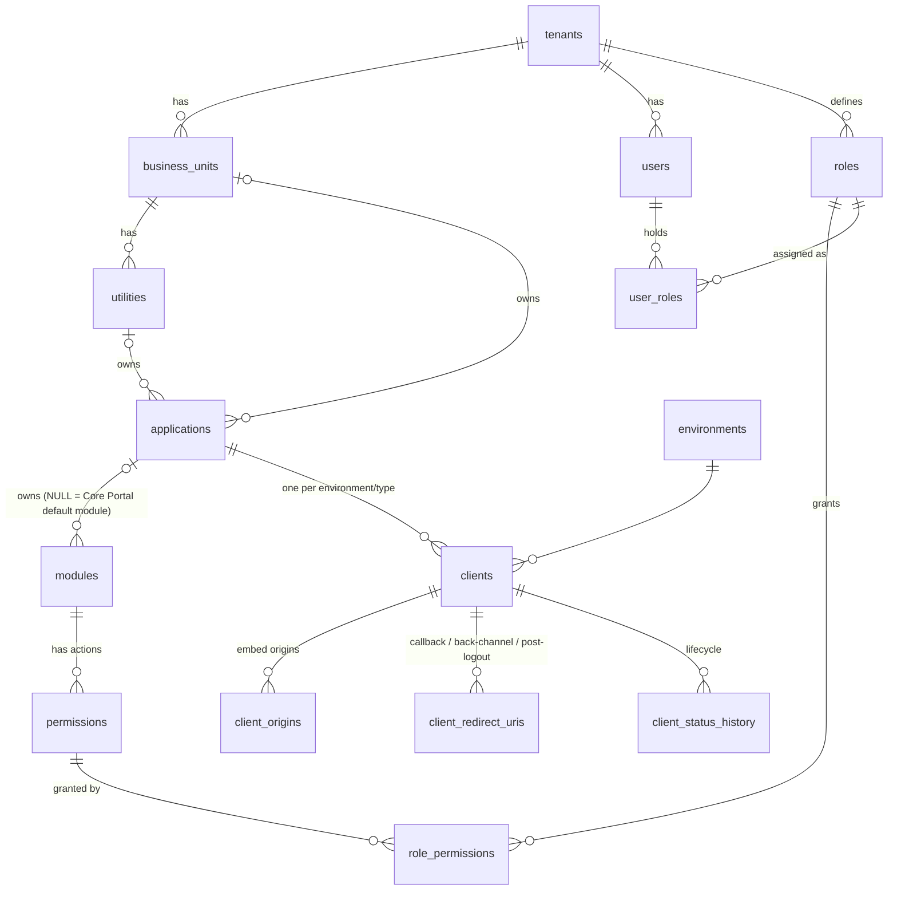

# Authorization data model: MIQAAT CORE Role & Permission Module

Three scope levels: **CORE** (whole tenant) → **BUSINESS_UNIT** → **UTILITY**. One person can hold several roles in several
scopes. Each role × scope pair is a **workspace** the user picks after login (`POST /select-scope`) and can switch at any time.

Passwords are **not** stored here. They live only in the Authentication DB `users.password_hash` (scrypt), keyed by the same `its_id`.
Every table has `created_at` and `updated_at`. A `set_updated_at` trigger maintains `updated_at`.

## Tables (doc schema)

| Table | Key columns |
|---|---|
| `tenants` | `tenant_id` PK, `name` unique, `status` (active/inactive) |
| `business_units` | `bu_id` PK, `tenant_id` FK, `name` (unique per tenant), `status` |
| `utilities` | `utility_id` PK, `bu_id` FK, `name` (unique per BU), `status` |
| `users` | `its_id` PK, `tenant_id` FK, `name`, `email`, `status` (active/inactive/suspended). **No password column.** |
| `modules` | `module_id` PK, `module_code` unique (`USER_MGMT`), `module_name`, `is_default`, `application_id` (NULL = Core Portal module) |
| `permissions` | `permission_id` PK, `module_id` FK, `action` (view/create/edit/delete/approve/export), `permission_code` unique (`USER_MGMT_EDIT`) |
| `roles` | `role_id` PK, `tenant_id` FK, `role_name` (unique per tenant), `scope_level` (CORE/BUSINESS_UNIT/UTILITY), `is_system_role` |
| `role_permissions` | PK (`role_id`, `permission_id`) |
| `user_roles` | `its_id`, `role_id`, `scope_type`, `scope_id` (NULL for CORE, else `bu_id`/`utility_id`), `assigned_at`; unique (`its_id`, `role_id`, `COALESCE(scope_id, nil)`) |

Integrity enforced in the database:

* `user_roles`: `scope_type = CORE` ⇔ `scope_id IS NULL`.
* Trigger `check_user_role_scope`: role `scope_level` = `scope_type`; the scope exists; role, user and scope are in the same tenant.
* `applications` has at most one owner (BU or utility).

Integration tables kept for embedded login: `applications`, `environments`, `clients`, `client_origins`, `client_redirect_uris`,
`client_status_history`, `service_principals` (public JWKS URI only), `authorization_audit_logs`.

## Default roles (system roles)

| Role | Level | Demo ITS ID |
|---|---|---|
| Platform Administrator | CORE | 30416234 |
| Business Unit Admin | BUSINESS_UNIT | 31189012 |
| BU Sub-Level Admin | BUSINESS_UNIT | 31145678 |
| Utility Admin | UTILITY | 31267890 (also Business Unit Admin @RMS: a multi-workspace demo) |
| Utility Sub-Level Admin | UTILITY | 31278901 |

## Default modules and permission matrix

V = view, C = create, E = edit, A = approve. The seed (`src/modules/rbac/seed/core-rbac.seed.ts`) and the e2e test implement this table.

| Module | Platform Admin | BU Admin | BU Sub-Level | Utility Admin | Utility Sub-Level |
|---|---|---|---|---|---|
| DASHBOARD | V | V | V | V | V |
| BUSINESS_UNIT_MGMT | V C E | | | | |
| UTILITY_MGMT | V C E | | | | |
| ROLE_MGMT | V C E | V C E | | V C E | |
| USER_MGMT | V C E | V C E | V E | V C E | V E |
| MUMIN_INFO | V | | | | |
| EVENT_CONTRACT | V C E A | V C A | V C | V C A | V C |
| API_CONTRACT | V C E A | V C A | V C | V C A | V C |
| CONTRACT_LIBRARY | | V | V | V | V |
| ACCESS_REQUEST | V C E A | V C A | V C | V C A | V C |
| TICKET_MGMT | V C E | V C E | V C | V C E | V C |
| MONITORING | V | V | V | V | V |
| AUDIT_LOG | V | V | | V | |
| CONFIGURATION | V E | V E | | V E | |

Application modules (for example `RMS_REGISTRATION`, `AMS_USERS`, `VMS_EVENTS`) are non-default modules tied to an application.
BU applications check them server-side through `POST /authorization/check`, using codes like `RMS_REGISTRATION_DELETE`.

## Login → workspace → permissions

1. Identity `POST /login` → `{its_id, name, token, requires_scope_selection, assignments[]}` (from `user_roles` joined to scope names).
2. Identity `POST /select-scope {role_id, scope_type, scope_id}` → re-validated here (`/internal/federation/assignments/resolve`)
   → `{active_scope, token}`. The token carries only `role_id`, `scope_type` and `scope_id`.
3. `GET /me/permissions` → `{MODULE_CODE: [actions]}` for the active role, ordered like the sidebar. A missing key means the module is hidden.
4. Switch Workspace repeats step 2. No logout, no DB change.

## Decision algorithm for BU applications (`POST /authorization/check`)

1. client exists → else `CLIENT_NOT_FOUND`; client `ACTIVE` → else `CLIENT_NOT_ACTIVE`
2. application and its BU/utility `active` → else `APPLICATION_INACTIVE`
3. user exists → `USER_NOT_FOUND`; user `active` → `USER_INACTIVE`
4. the user's assignments whose scope **covers** the application owner:
   CORE covers everything; a BU covers itself and its utilities; a utility covers itself
5. their role permissions in modules owned by this application → permission held → `allowed`, otherwise `PERMISSION_DENIED` / `MODULE_MISMATCH`

Results are cached per `(its_id, client_id)` and invalidated immediately on any RBAC change.

## Seed data (local)

`npm run seed` creates the tenant (`DEFAULT_TENANT_NAME`), the 5 system roles, 14 default modules with the matrix above, BUs RMS, VMS,
Mumin Services and Core Services, utilities Helpdesk and Zone Support (RMS) and AMS (Core Services), applications with their modules and
custom roles, 15 clients and the service principals. `npm run seed:access` assigns workspaces to synced users. For example, `30337752` gets
Platform Administrator (CORE), RMS Registration Admin @RMS, AMS User Admin @AMS, VMS Viewer @VMS and Mumin Member @Mumin Services.
